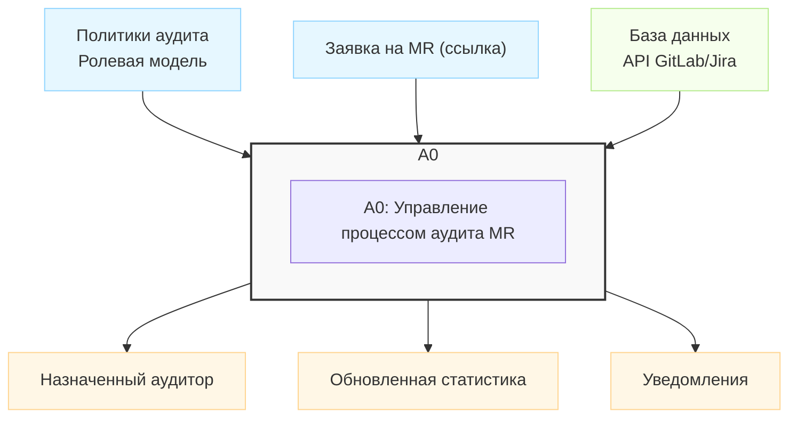
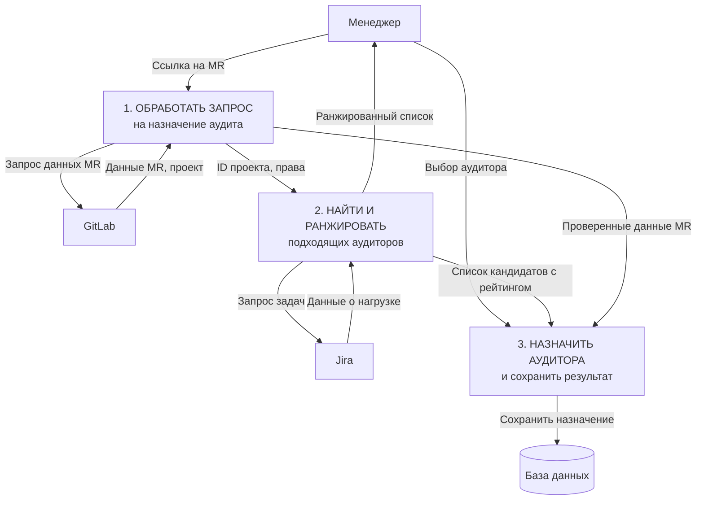
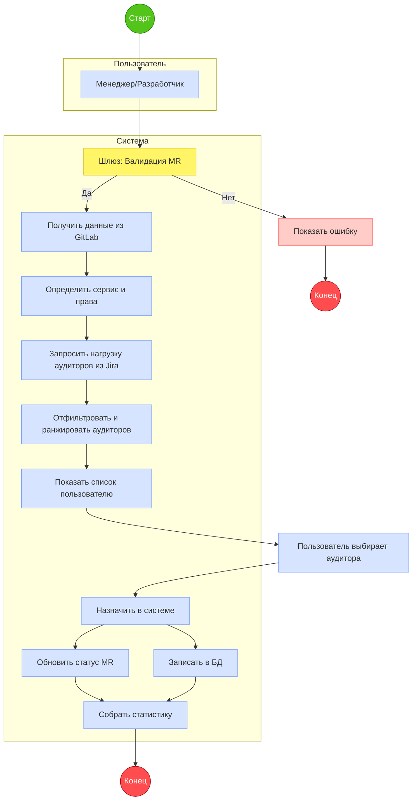
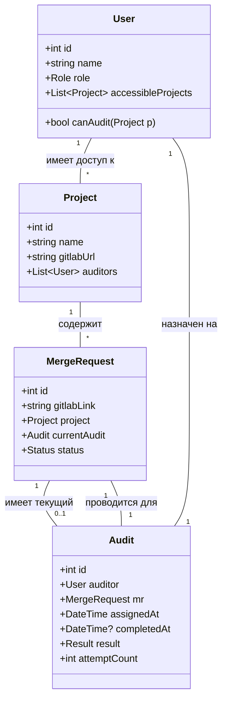
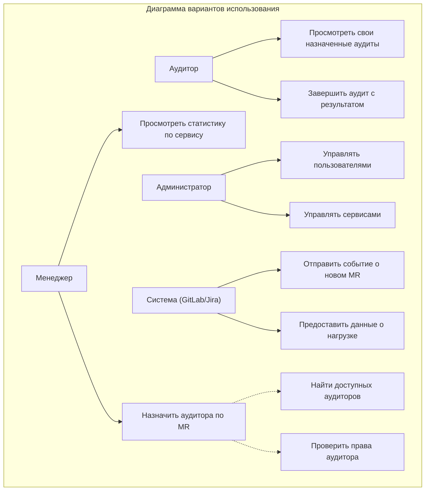
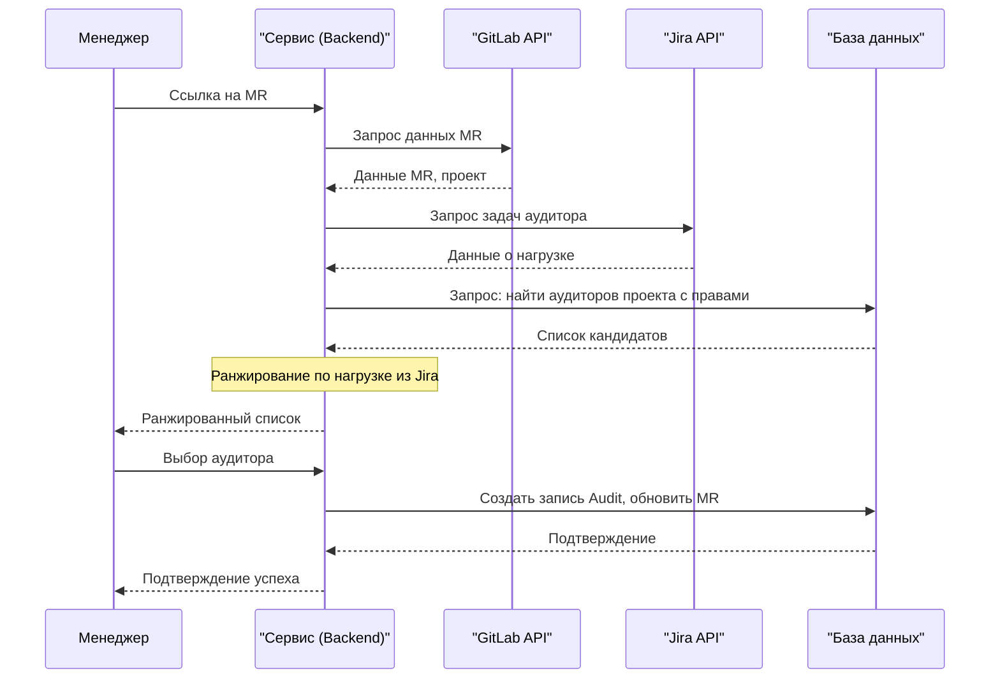
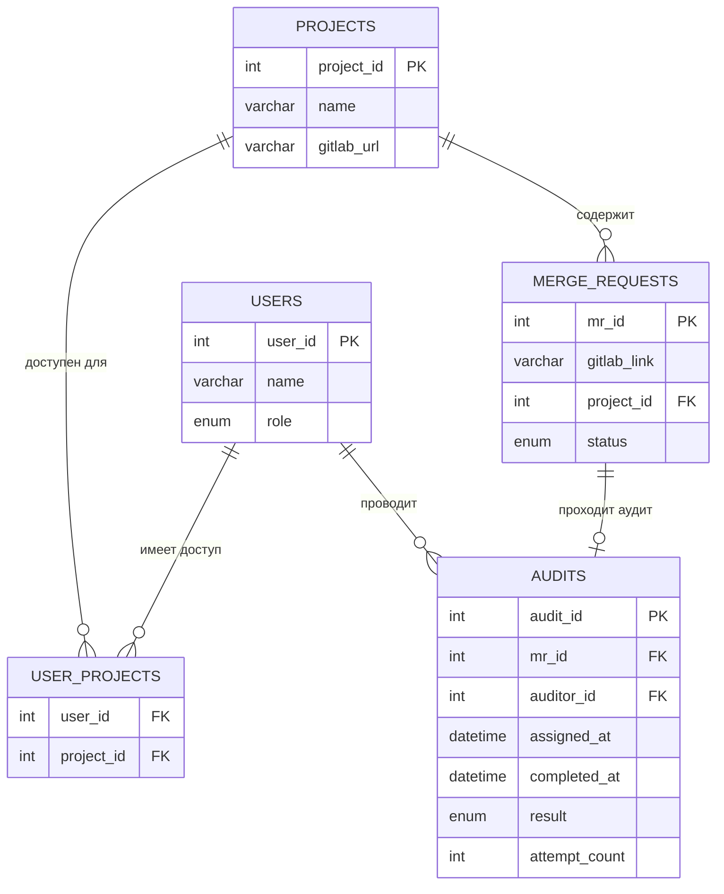

Отлично, на основе ваших ответов подготовлю структурированный документ. Заполню пункты, где информации достаточно, а в описаниях моделей дам шаблоны с пояснениями, которые вы сможете детализировать.

---

### **Требования к оформлению проекта**

#### **1. Краткое описание проекта**

**1.1. Ф.И.О. разработчиков**
Эйзерман Александр Николаевич

**1.2. Группа**
Д-Э 311

**1.3. Тема проекта**
Сервис для просмотра, назначения и изменения аудиторов

**1.4. Цель проекта**
Сделать процесс аудирования в компании прозрачнее, обеспечить равномерное распределение нагрузки по аудиторам, собрать статистику по количеству попыток до успешного прохождения аудита.

**1.5. Задачи проекта**
1. Реализовать систему управления сервисами с указанием GitLab-репозиториев.
2. Создать механизм управления пользователями с ролями: Разработчик, Менеджер, Админ.
3. Реализовать поиск подходящих аудиторов по имени сервиса или ссылке на Merge Request.
4. Реализовать проверку по MR и выбранному аудитору из списка, может ли он его аудировать.
5. Реализовать отображение возможных списков аудиторов у выбранного сервиса, или для MR в порядке от самого свободного до самого нагруженного.
6. Интегрировать систему с Jira для отслеживания нагрузки аудиторов через webhook.
7. Собирать статистику по количеству попыток до успешного прохождения аудита.

**1.6. Аннотация**
Сервис автоматизирует подбор и назначение аудиторов для код-ревью (аудита) Merge Request в проектах компании. Ключевые возможности включают интеллектуальный поиск доступных аудиторов на основе сервиса или MR, проверку их прав, ранжирование по текущей нагрузке и интеграцию с GitLab и Jira для актуальности данных. Основные пользователи — менеджеры и разработчики — получают инструмент для быстрого назначения аудитов, что повышает эффективность и прозрачность процессов разработки. Система также предоставляет аналитику по количеству попыток прохождения аудита для выявления узких мест.

---

### **2. Документация**

#### **2.1. Подробное описание проекта**
Сервис представляет собой классическое трехзвенное веб-приложение (клиент-сервер).
*   **Frontend:** Веб-интерфейс на JavaScript (рекомендуется фреймворк, например, React или Vue.js) для взаимодействия пользователей.
*   **Backend:** RESTful API сервер на языке Go, обрабатывающий бизнес-логику, авторизацию и интеграции.
*   **Database:** Реляционная база данных MySQL для хранения информации о пользователях, сервисах, MR, аудитах и статистике.
*   **Интеграции:**
    *   **GitLab:** Взаимодействие через REST API для получения информации о Merge Request, репозиториях и пользователях. Возможно использование webhook для отслеживания событий с MR.
    *   **Jira:** Интеграция через REST API для получения задач, связанных с аудиторами, что позволяет оценить их текущую нагрузку.
*   **Основной сценарий использования:**
    1.  Разработчик создает Merge Request в GitLab.
    2.  Текущий назначенный аудитор занят (нагрузка из Jira, статус в системе).
    3.  Разработчик или менеджер открывает сервис, вводит ссылку на MR или выбирает сервис.
    4.  Система, запросив данные из GitLab, определяет проект и находит всех пользователей с ролью "Аудитор", у которых есть права на этот проект.
    5.  Система запрашивает из Jira текущее количество активных задач у каждого кандидата, ранжирует их по возрастанию нагрузки.
    6.  Пользователю выдается ранжированный список доступных аудиторов.
    7.  Пользователь выбирает аудитора и назначает аудит. Система фиксирует назначение и может отправить уведомление.

#### **2.2. Ментальная карта**
```
Сервис аудирования
├── Пользователи
│   ├── Роли (Разработчик, Менеджер, Аудитор, Админ)
│   ├── Атрибуты (ID, Имя, Уровень доступа, Токены для API)
│   └── Действия (Назначить аудит, Просмотреть статистику)
├── Сервисы (Проекты)
│   ├── Название
│   ├── Ссылка на GitLab репозиторий
│   └── Список аудиторов с правами
├── Merge Request (MR)
│   ├── Ссылка на GitLab
│   ├── Статус (Ожидает, Назначен, Завершен)
│   └── Связанный сервис
├── Аудит
│   ├── MR (ссылка)
│   ├── Аудитор (пользователь)
│   ├── Дата назначения/завершения
│   ├── Результат (Успех/Неудача)
│   └── Счетчик попыток
├── Интеграции
│   ├── GitLab (получение данных о MR)
│   └── Jira (получение нагрузки аудиторов)
└── Статистика
    ├── Попытки до успешного аудита (по сервисам/командам)
    └── Нагрузка аудиторов (графики/отчеты)
```
Карта отражает ключевые доменные сущности системы и их взаимосвязи, начиная от пользователей и заканчивая аналитикой.

#### **2.3. Модель в нотации IDEF0 (контекстная диаграмма A-0)**

Контекстная диаграмма показывает систему как единый блок (A0). **Вход** — заявка на аудит (ссылка на MR). **Выход** — результат работы системы (назначенный аудитор, данные). **Управление** — регламенты компании. **Механизмы** — техническая реализация.

#### **2.4. Фрагмент модели в нотации DFD (уровень декомпозиции A0)**

DFD показывает потоки данных между процессами (овалы) и внешними сущностями (прямоугольники). Видно, как данные перетекают от пользователя через процессы взаимодействия с GitLab и Jira к сохранению в БД.

#### **2.5. Модель в нотации BPMN**

BPMN визуализирует бизнес-процесс с точки зрения участников и последовательности действий. Видны альтернативные пути (ошибка), параллельные действия (обновление статуса и запись) и интеграции (GitLab, Jira).

#### **2.6. Модели в нотации UML**

**2.6.1. Диаграмма классов (Структурная)**

Показывает основные сущности, их атрибуты, методы и связи. Например, связь между `Audit` и `MergeRequest` — "проводится для" (один к одному).

**2.6.2. Диаграмма вариантов использования (Поведенческая)**

Определяет, какие действия (use case) доступны каждому типу пользователя (актору). Показывает связи между use case (например, `include`).

**2.6.3. Диаграмма последовательностей (Поведенческая)**

Детально показывает хронологию обмена сообщениями между объектами для сценария "Назначение аудитора".

#### **2.7. ER диаграмма**

Таблица `USER_PROJECTS` — это связующая таблица "многие-ко-многим" между пользователями и проектами (для хранения прав аудиторов на сервисы). Связь между `MERGE_REQUESTS` и `AUDITS` — "один-к-одному", так как у одного MR в один момент времени может быть только один активный аудит.
