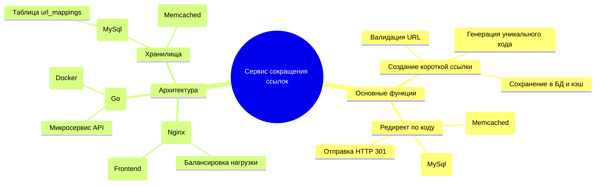
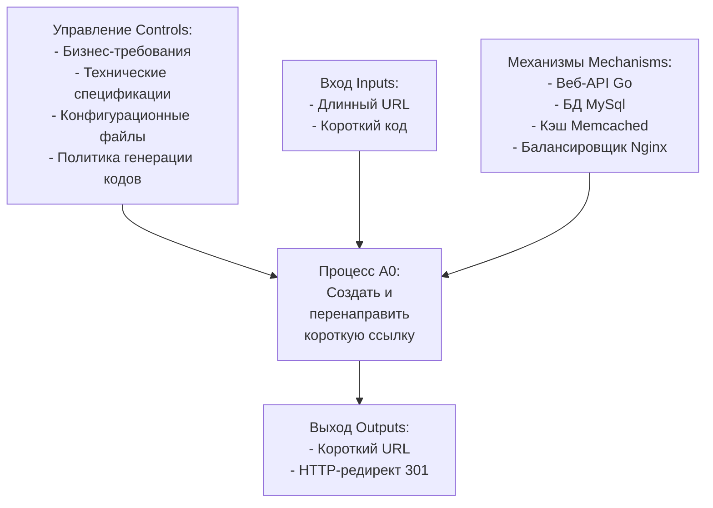
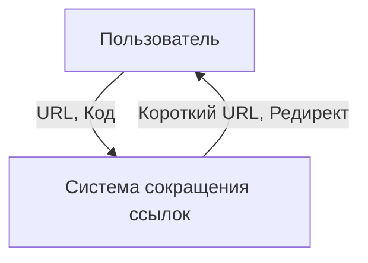
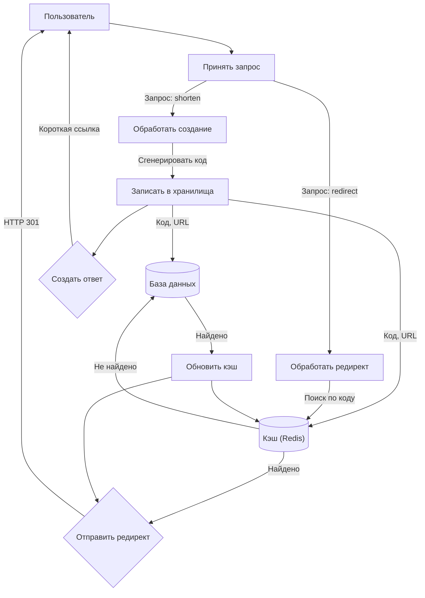
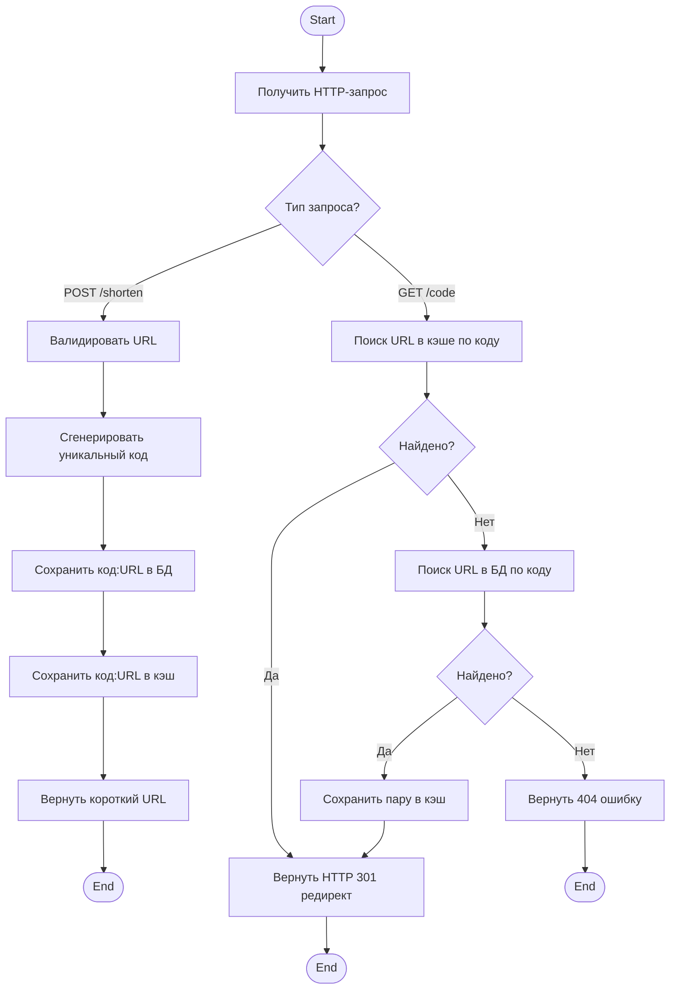
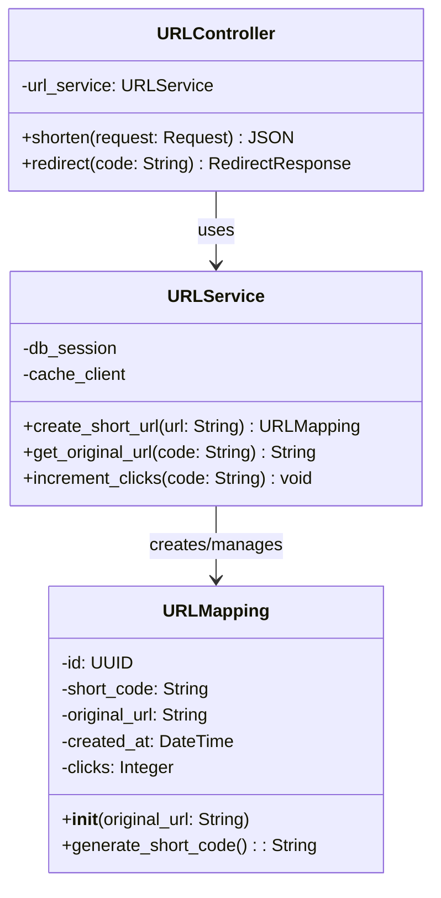
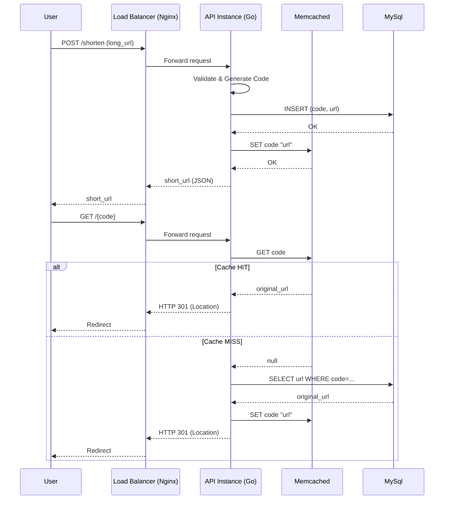
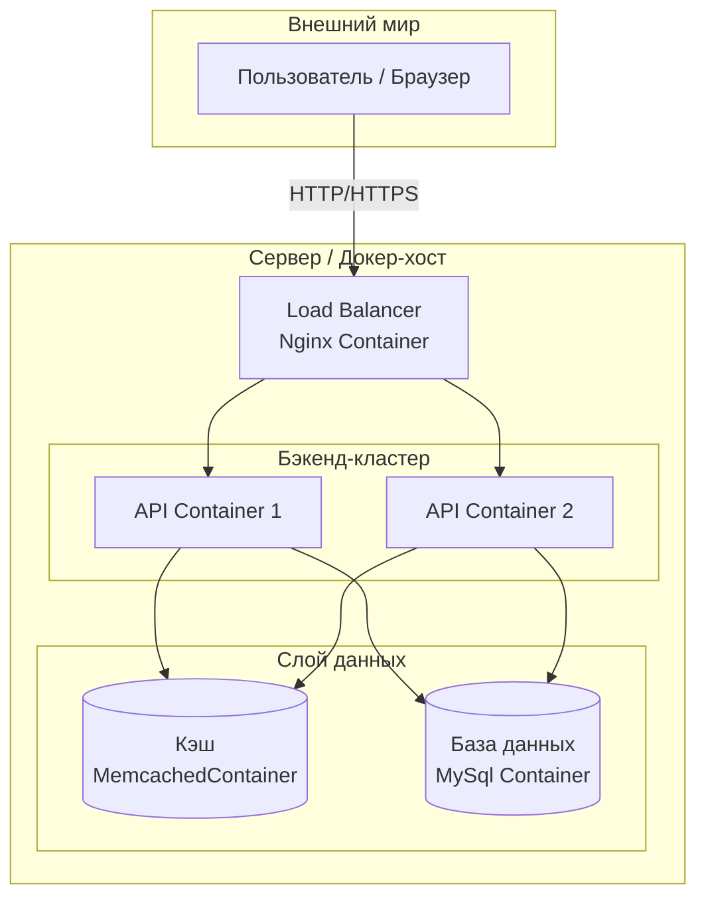

### **1. Краткое описание проекта**

**1.1. Ф.И.О. разработчиков.**  
Эйзерман Александр Николаевич

**1.2. Группа.**  
Д-Э 311

**1.3. Тема проекта.**  
Разработка высоконагруженного веб-сервиса для сокращения URL-адресов.

**1.4. Цель проекта.**  
Создать отказоустойчивый, масштабируемый сервис сокращения ссылок, обеспечивающий высокую скорость создания коротких ссылок и мгновенное перенаправление пользователей.

**1.5. Задачи проекта.**
1.  Проектирование и реализация RESTful API для основных операций: создание короткой ссылки и редирект по коду.
2.  Проектирование и развертывание базы данных MySql для постоянного хранения соответствий.
3.  Внедрение кэширующего слоя (Memcached) для ускорения операций чтения (редиректов).
4.  Проектирование архитектуры с балансировщиком нагрузки (Nginx) для горизонтального масштабирования сервиса.
5.  Документирование процесса проектирования (ментальные карты, IDEF0, DFD, BPMN, UML, ER).
6.  Контейнеризация сервисов с использованием Docker и Docker Compose.

**1.6. Аннотация.**  
Проект представляет собой полный цикл разработки современного облачного сервиса. Система позволяет пользователям преобразовывать длинные URL в короткие, удобные для использования в соцсетях, мессенджерах и QR-кодах. Ключевыми особенностями являются высокая доступность и производительность, достигнутые за счет разделения на микросервисы, использования реляционной базы данных для надежности и кэша для скорости. Все компоненты развертываются в контейнерах, что обеспечивает легкую масштабируемость и переносимость.
### **2. Документация**

#### **2.1. Подробное описание проекта.**

Проект представляет собой распределенную систему, состоящую из нескольких логических компонентов:
*   **Веб-приложение (API):** Ядро системы, написанное на Go. Отвечает за бизнес-логику: прием запросов, генерацию кода, взаимодействие с БД и кэшем.
*   **База данных (MySql):** Хранит основную информацию: уникальный код, оригинальный URL, дату создания, счетчик переходов.
*   **Кэш (Memcached):** Служит для хранения пар «код-URL» с высокой скоростью доступа. Значительно снижает нагрузку на БД при частых редиректах.
*   **Балансировщик нагрузки (Nginx):** Распределяет входящие HTTP-запросы между несколькими экземплярами веб-приложения для обеспечения отказоустойчивости и горизонтального масштабирования.
*   **Клиентское приложение:** Простой веб-интерфейс на HTML/JS для взаимодействия пользователя с API.

Сценарий работы: Пользователь через интерфейс отправляет длинный URL. Запрос через Nginx попадает на один из экземпляров API. API генерирует короткий код (например, `aBc4d`), сохраняет пару в БД, помещает ее в Redis и возвращает короткую ссылку. При переходе по короткой ссылке API сначала проверяет кэш. При попадании редирект выполняется мгновенно. При промахе данные запрашиваются из БД, заносятся в кэш и выполняется редирект. При отсутствии возвращается ошибка Not Found (404)

#### **2.2. Ментальная карта**

#### **2.3. Модель в нотации IDEF0**

**A0: "Создать и перенаправить короткую ссылку"**
*   **Вход (I):** Оригинальный URL от пользователя; Запрос на редирект с коротким кодом.
*   **Выход (O):** Короткий URL; HTTP-редирект на оригинальный URL; Статистика.
*   **Управление (C):** Бизнес-правила (формат URL, длина кода), конфигурационные файлы.
*   **Механизмы (M):** Веб-сервер (FastAPI), СУБД PostgreSQL, Кэш Redis.

#### **2.4. Фрагменты модели в нотации DFD**

**DFD Уровень 0 (Контекстная диаграмма):**

**DFD Уровень 1 (Декомпозиция системы):**

DFD показывает потоки данных в системе. На уровне 1 видно разделение процессов на создание ссылки и редирект. Ключевой момент — процесс редиректа (`P3`) сначала обращается к кэшу (`D2`), и только в случае промаха идет в основную БД (`D1`), после чего обновляет кэш (`P5`). Это иллюстрирует стратегию ускорения чтения
#### **2.5. Модель в нотации BPMN**

#### **2.6. Модели в нотации UML.**

**2.6.1. Диаграмма классов (Структурный тип)**

`URLMapping` — модель данных. `URLService` — класс, инкапсулирующий бизнес-логику (работа с БД, кэшем). `URLController` — обработчик HTTP-запросов

**2.6.2. Диаграмма последовательности (Поведенческий тип)**

**2.6.3. Диаграмма развертывания (Структурный тип)**

